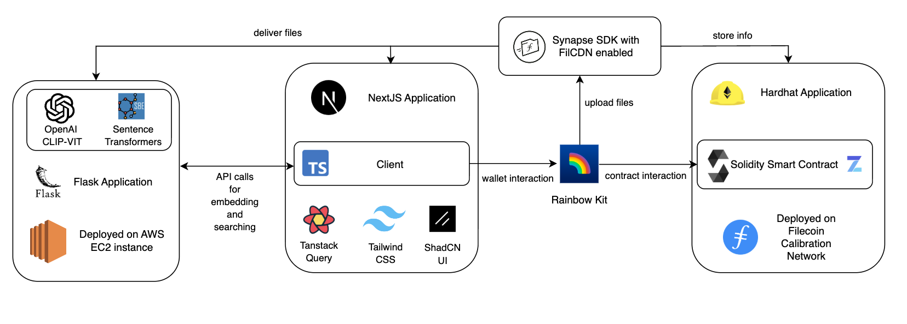

<div align="center">

# FilDOS

### A Secure, AI-Native, Meaning-First Decentralized Drive

[](https://opensource.org/licenses/MIT)
[](https://nextjs.org/)
[](https://www.typescriptlang.org/)
[](https://filecoin.io/)
[](https://www.python.org/)

**Forget CIDs. Access your files like you think — by meaning.**

[Demo](https://fildos.vercel.app/) · [Video](https://youtu.be/Qr5B9RzHYEs) · [Report Bug](https://github.com/ArqosLabs/FilDOS/issues) · [Request Feature](https://github.com/ArqosLabs/FilDOS/issues)

</div>

---

## Table of Contents

- [About](#about)
- [Key Features](#key-features)
- [Architecture](#architecture)
- [Tech Stack](#tech-stack)
- [Getting Started](#getting-started)
  - [Prerequisites](#prerequisites)
  - [Installation](#installation)
  - [Environment Configuration](#environment-configuration)
  - [Running the Application](#running-the-application)
- [Usage](#usage)
- [Project Structure](#project-structure)
- [API Reference](#api-reference)
- [Smart Contracts](#smart-contracts)
- [Contributing](#contributing)
- [License](#license)
- [Acknowledgments](#acknowledgments)
- [Contact](#contact)

---

## About


FilDOS is a revolutionary decentralized storage platform built on Filecoin that enables users to store, search, and share files by meaning rather than cryptic identifiers like CIDs. It combines the power of blockchain technology with AI-driven semantic search to create a truly human-centric storage experience.

### The Problem

Traditional decentralized storage systems force users to interact with content through opaque identifiers (CIDs), making file discovery and organization frustrating and unintuitive.

### Our Solution

FilDOS transforms your decentralized drive into an intelligent, searchable repository where you find files the way you think about them—by meaning, context, and content.

---

## Key Features

| Feature | Description |
|---------|-------------|
| 🔍 **Semantic Search** | Find files by meaning, not CIDs. Search using natural language queries like "meeting notes from last week" or "photos from the conference" |
| 📂 **NFT-Based Folders** | Folders as ERC-721 NFTs with embedded metadata, ownership, and granular access control |
| 📦 **Drive Capsules** | Every file becomes a portable capsule with metadata, embeddings, and encryption support |
| 🔗 **Agent-Compatible** | Designed for AI agents to own, manage, and interact with storage programmatically |
| 🔐 **Encryption Support** | Lit Protocol integration for client-side encryption with decentralized access control |
| 💰 **Paid Access** | Monetize your content with USDFC-based paid viewing for public folders |
| 🏷️ **Tag-Based Organization** | Query files by tags across all your folders for quick discovery |

---

## Architecture

<p align="center">
  
</p>

### System Overview

```
┌─────────────────────────────────────────────────────────────────────┐
│                         FilDOS Platform                              │
├─────────────────┬─────────────────────┬─────────────────────────────┤
│    Frontend     │     AI Service      │       Blockchain            │
│   (Next.js)     │      (Flask)        │    (Filecoin FEVM)          │
├─────────────────┼─────────────────────┼─────────────────────────────┤
│ • React 19      │ • CLIP Embeddings   │ • ERC-721 Folder NFTs       │
│ • TypeScript    │ • SentenceTransform │ • Access Control            │
│ • Tailwind CSS  │ • Weaviate Vector   │ • Paid Viewing (USDFC)      │
│ • shadcn/ui     │   Database          │ • File Metadata Storage     │
│ • Web3Auth      │ • Multi-modal       │ • Sharing Permissions       │
│ • wagmi/viem    │   Support           │                             │
└─────────────────┴─────────────────────┴─────────────────────────────┘
                              │
                              ▼
┌─────────────────────────────────────────────────────────────────────┐
│                    Storage Infrastructure                            │
├─────────────────────────────────────────────────────────────────────┤
│  Filecoin Storage Providers  •  FilCDN  •  Synapse SDK              │
└─────────────────────────────────────────────────────────────────────┘
```

---

## Tech Stack

### Frontend
- **Framework**: [Next.js 15](https://nextjs.org/) with [React 19](https://react.dev/)
- **Language**: [TypeScript 5](https://www.typescriptlang.org/)
- **Styling**: [Tailwind CSS 4](https://tailwindcss.com/) + [shadcn/ui](https://ui.shadcn.com/)
- **Animations**: [Framer Motion](https://www.framer.com/motion/)
- **Icons**: [Lucide React](https://lucide.dev/)

### Web3
- **Blockchain**: [Filecoin FEVM](https://docs.filecoin.io/smart-contracts/fundamentals/the-fvm) (Calibration Testnet)
- **Wallet Connection**: [Web3Auth](https://web3auth.io/) + [wagmi](https://wagmi.sh/)
- **Ethereum Library**: [viem](https://viem.sh/) + [ethers.js](https://docs.ethers.org/)
- **Smart Contracts**: Solidity 0.8.20 + [Hardhat](https://hardhat.org/)
- **Storage SDK**: [Synapse SDK](https://www.npmjs.com/package/@filoz/synapse-sdk)

### AI Service
- **Framework**: [Flask](https://flask.palletsprojects.com/)
- **Image Embeddings**: [CLIP](https://github.com/openai/CLIP) (openai/clip-vit-base-patch32)
- **Text Embeddings**: [SentenceTransformers](https://www.sbert.net/) (all-MiniLM-L6-v2)
- **Vector Database**: [Weaviate](https://weaviate.io/)
- **Production Server**: [Gunicorn](https://gunicorn.org/)

### Encryption
- **Access Control**: [Lit Protocol](https://litprotocol.com/)

---

## Getting Started

### Prerequisites

Before you begin, ensure you have the following installed:

- **Node.js** 18.0 or higher ([Download](https://nodejs.org/))
- **Python** 3.8 or higher ([Download](https://www.python.org/downloads/))
- **Docker** (for Weaviate vector database) ([Download](https://www.docker.com/))
- **Git** ([Download](https://git-scm.com/))
- A Web3 wallet (MetaMask or compatible)

### Installation

1. **Clone the repository**
   ```bash
   git clone https://github.com/ArqosLabs/FilDOS.git
   cd FilDOS
   ```

2. **Install frontend dependencies**
   ```bash
   npm install
   ```

3. **Set up the AI service**
   ```bash
   cd ai
   pip install -r requirements.txt
   python download_models.py  # Downloads AI models
   cd ..
   ```

4. **Set up smart contract development** (optional)
   ```bash
   cd web3
   npm install
   cd ..
   ```

### Environment Configuration

1. **Frontend environment**
   ```bash
   cp env.example .env
   ```
   
   Edit `.env` with your configuration:
   ```env
   NEXT_PUBLIC_AI_SERVER_URL=http://localhost:5001
   NEXT_PUBLIC_CLIENT_ID=your_web3auth_client_id
   ```

2. **AI service environment**
   ```bash
   cd ai
   cp env.example .env
   ```

3. **Smart contracts environment** (optional)
   ```bash
   cd web3
   cp env.example .env
   ```
   
   Edit with your configuration:
   ```env
   PRIVATE_KEY=your_private_key
   CALIBRATION_RPC_URL=https://api.calibration.node.glif.io/rpc/v1
   ```

### Running the Application

1. **Start Weaviate** (vector database)
   ```bash
   docker run -d \
     -p 8080:8080 \
     --name weaviate \
     semitechnologies/weaviate:latest
   ```

2. **Start the AI service** (in `ai/` directory)
   ```bash
   cd ai
   python start.py
   ```
   The AI service will be available at `http://localhost:5001`

3. **Start the frontend** (in root directory, new terminal)
   ```bash
   npm run dev
   ```
   The application will be available at `http://localhost:3000`

4. **Configure your wallet**
   - Connect MetaMask or Web3Auth
   - Switch to Filecoin Calibration network
     - Network Name: `Filecoin Calibration`
     - RPC URL: `https://api.calibration.node.glif.io/rpc/v1`
     - Chain ID: `314159`
     - Currency Symbol: `tFIL`

---

## Usage

### Quick Start Workflow

<p align="center">
  
</p>

1. **Connect Wallet** — Connect your MetaMask or use Web3Auth social login
2. **Purchase Storage** — Mint your first folder NFT to create storage
3. **Upload Files** — Upload files with automatic AI-powered metadata generation
4. **Semantic Search** — Find files using natural language queries
5. **Share & Collaborate** — Share folders with specific addresses or make them public

### Search Examples

```
"meeting notes from last week"
"design documents about authentication"
"photos from the conference"
"contracts related to user onboarding"
```

<p align="center">
  
</p>

### Supported File Types

| Category | Extensions |
|----------|------------|
| **Images** | `.jpg`, `.jpeg`, `.png`, `.bmp`, `.webp` |
| **Documents** | `.pdf`, `.docx`, `.txt`, `.md` |
| **Spreadsheets** | `.xlsx`, `.csv` |
| **Presentations** | `.pptx` |
| **Audio** | `.mp3`, `.wav` |
| **Video** | `.mp4`, `.mov` |

---

## Project Structure

```
FilDOS/
├── src/                    # Next.js frontend source
│   ├── app/                # App router pages
│   ├── components/         # React components
│   ├── hooks/              # Custom React hooks
│   ├── lib/                # Utility libraries
│   ├── providers/          # Context providers
│   └── utils/              # Helper functions
├── ai/                     # AI embedding service
│   ├── app.py              # Flask API
│   ├── start.py            # Development server
│   ├── production.py       # Production server
│   └── requirements.txt    # Python dependencies
├── web3/                   # Smart contracts
│   ├── contracts/          # Solidity contracts
│   │   └── FILDOS.sol      # Main contract
│   └── ignition/           # Deployment scripts
├── public/                 # Static assets
└── package.json            # Node.js dependencies
```

---

## API Reference

### AI Service Endpoints

| Endpoint | Method | Description |
|----------|--------|-------------|
| `/embed` | POST | Create embeddings for files from URLs |
| `/search` | POST | Semantic search through collections |
| `/collections` | GET | List all collections |
| `/collections/<name>` | GET | Get collection details |
| `/collections/<name>` | DELETE | Delete a collection |
| `/health` | GET | Health check and model status |

#### Example: Semantic Search

```bash
curl -X POST http://localhost:5001/search \
  -H "Content-Type: application/json" \
  -d '{
    "query": "meeting notes from last week",
    "collection_name": "MyFiles",
    "top_k": 5
  }'
```

For complete API documentation, see [`ai/README.md`](./ai/README.md).

---

## Smart Contracts

FilDOS uses ERC-721 NFTs for decentralized folder management on Filecoin FEVM.

### Core Functions

| Function | Description |
|----------|-------------|
| `mintFolder(name, type)` | Create a new folder NFT |
| `addFile(tokenId, cid, ...)` | Add a file to a folder |
| `shareFolder(tokenId, grantee, ...)` | Grant access to another user |
| `setFolderPublic(tokenId, isPublic, price)` | Make folder public with optional pricing |
| `payForViewAccess(tokenId)` | Pay USDFC for access to paid folder |

### Access Control Model

```
┌─────────────────────────────────────────────────────────────────────┐
│                    Access Control                                    │
├─────────────────┬───────────────────────────────────────────────────┤
│ Private Folder  │ Owner + Explicitly shared users only              │
│ Public (Free)   │ Anyone can view (price = 0)                       │
│ Public (Paid)   │ Pay USDFC to owner for access                     │
│ Selective Share │ Grant read/write to specific addresses            │
└─────────────────┴───────────────────────────────────────────────────┘
```

### Deployment

```bash
cd web3
npm install
npx hardhat compile
npx hardhat ignition deploy ignition/modules/FILDOS.ts --network calibration
```

For complete smart contract documentation, see [`web3/README.md`](./web3/README.md).

---

## Contributing

Contributions are what make the open source community amazing! Any contributions you make are **greatly appreciated**.

### How to Contribute

1. **Fork the Project**
2. **Create your Feature Branch**
   ```bash
   git checkout -b feature/AmazingFeature
   ```
3. **Commit your Changes**
   ```bash
   git commit -m 'Add some AmazingFeature'
   ```
4. **Push to the Branch**
   ```bash
   git push origin feature/AmazingFeature
   ```
5. **Open a Pull Request**

### Development Guidelines

- Follow the existing code style and conventions
- Write meaningful commit messages
- Add tests for new features when applicable
- Update documentation as needed
- Ensure all linting passes (`npm run lint`)

### Running Tests & Linting

```bash
# Lint the codebase
npm run lint

# Type check
npm run type-check

# Build check
npm run build-check
```

---

## License

Distributed under the MIT License. See [`LICENSE`](./LICENSE) for more information.

---

## Acknowledgments

- [Filecoin](https://filecoin.io/) — Decentralized storage network
- [Protocol Labs](https://protocol.ai/) — For building the future of the web
- [OpenAI CLIP](https://github.com/openai/CLIP) — Multi-modal AI model
- [Weaviate](https://weaviate.io/) — Vector database
- [Lit Protocol](https://litprotocol.com/) — Decentralized encryption
- [shadcn/ui](https://ui.shadcn.com/) — Beautiful UI components
- [Vercel](https://vercel.com/) — Hosting and deployment

---

## Contact

**Arqos Labs**

- Website: [fildos.vercel.app](https://fildos.vercel.app/)
- GitHub: [@ArqosLabs](https://github.com/ArqosLabs)

---

<div align="center">

**Built with ❤️ for the decentralized future**

⭐ Star this repository if you found it helpful!

</div>
